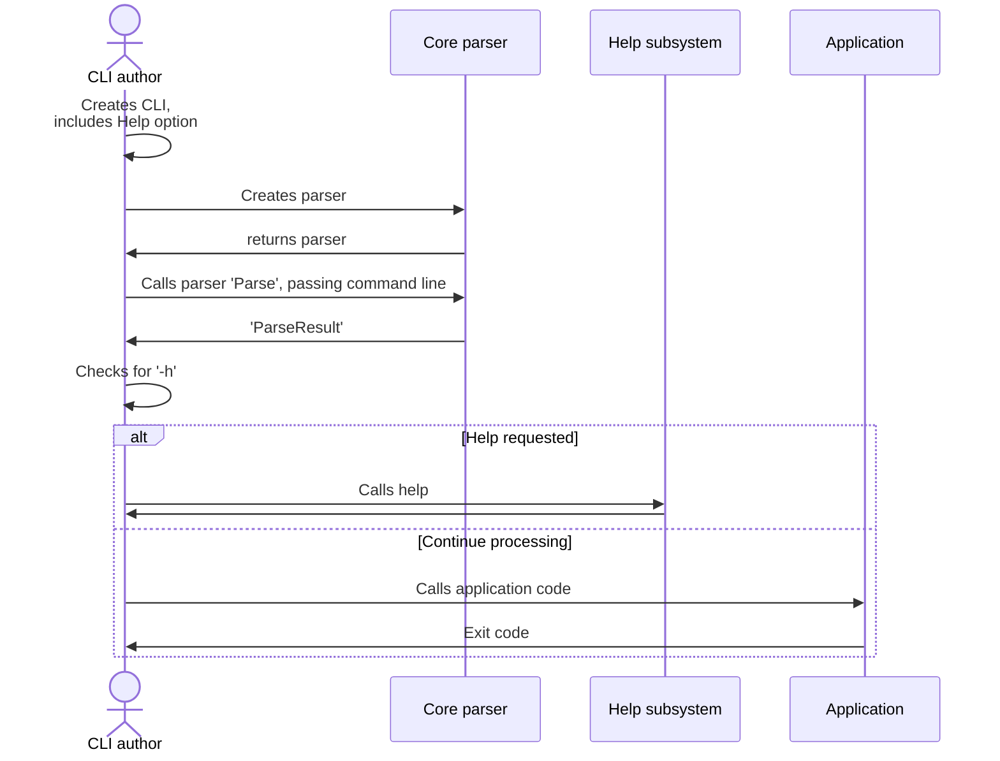
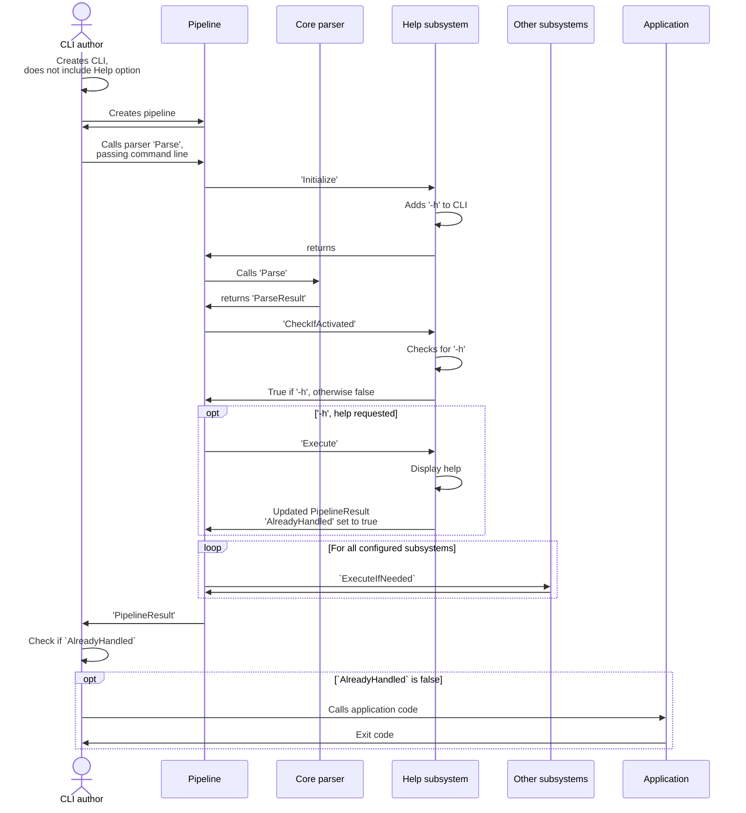
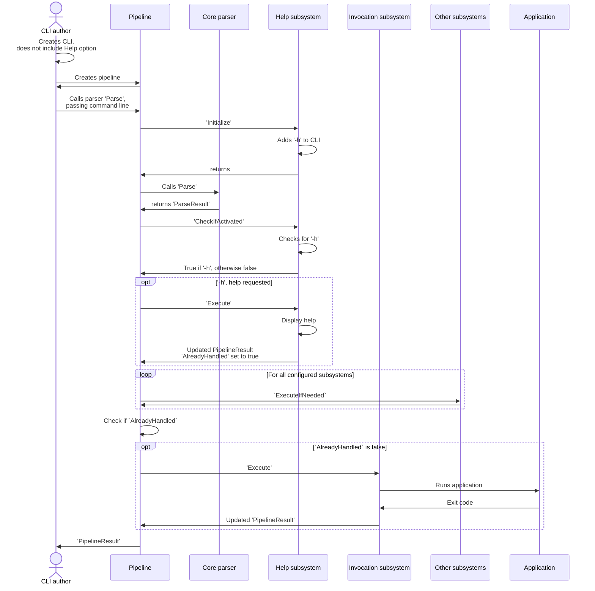

# Docs for folks extending System.CommandLine subsystem

There are a few ways to extend System.CommandLine subsystems

* Replace an existing subsystem, such as replacing Help.
* Add a new subsystem we did not implement.
* Supply multiple subsystems for an existing category, such as running multiple Help subsystems.

This design is based on the following assumptions:

* There will be between 10 and 10,000 CLI authors for every extender.
* There will be more replacement of existing subsystems than creation of new ones.
* CLI authors will often want to replace subsystems, especially help.
* Some folks will want extreme extensibility.
* Data needs to be exchanged between subsystems (this is the area of most significant change from prior versions).

We believe the space is fairly well understood, and that the subsystems we supply will cover most scenarios. However, we know of additional scenarios, such as prompting for required data.

Subsystems can be used with or outside the pipeline.

## Calling a subsystem without the pipeline



## Subsystem calls with the pipeline, without invocation




## Subsystem calls with the pipeline, with invocation



## Replacing an existing subsystem or adding a new one

* Inherit from the existing subsystem or CliSubsystem
* Override `GetIsActivated`, unless your subsystem should never run (such as you have initialization only behavior):
  * You will generally not need to do this except for new subsystems that need to add triggers.
  * If your subsystem should run even if another subsystem has handled execution (extremely rare), set `ExecuteEvenIfAlreadyHandled`
* Override `Initialize` if needed:
  * You will generally not need to do this except for new subsystems that need to respond to their triggers.
  * Delay as much work as possible until it is actually needed.
* Override `Execute`:
  * Ensure that output is sent to `Console` on the pipeline, not directly to `StdOut`, `StdErr` or `System.Console`
* To manage data:
  * For every piece data value, create a public `Get...` and `Set...` method using the accessor pattern that allows  CLI authors to use the `With` extension method and implicitly converts to string (replace "Description" with the name of your data value in 6 places and possibly change the type in 2 places):

```csharp
    public void SetDescription(CliSymbol symbol, string description) 
        => SetAnnotation(symbol, HelpAnnotations.Description, description);

    public AnnotationAccessor<string> Description 
        => new(this, HelpAnnotations.Description);
```

* Let folks know to add your subsystem, or provide an alternative to StandardPipeline.


